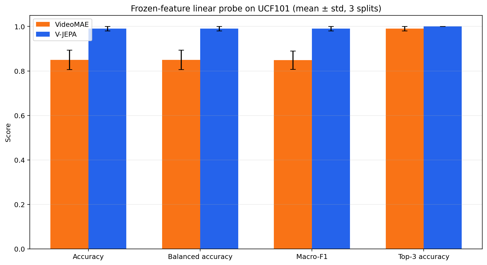
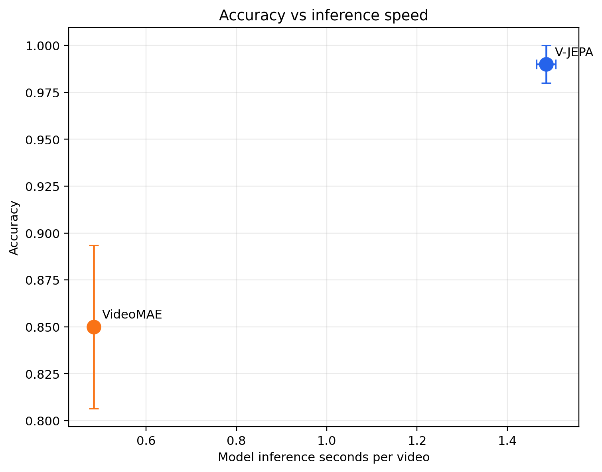
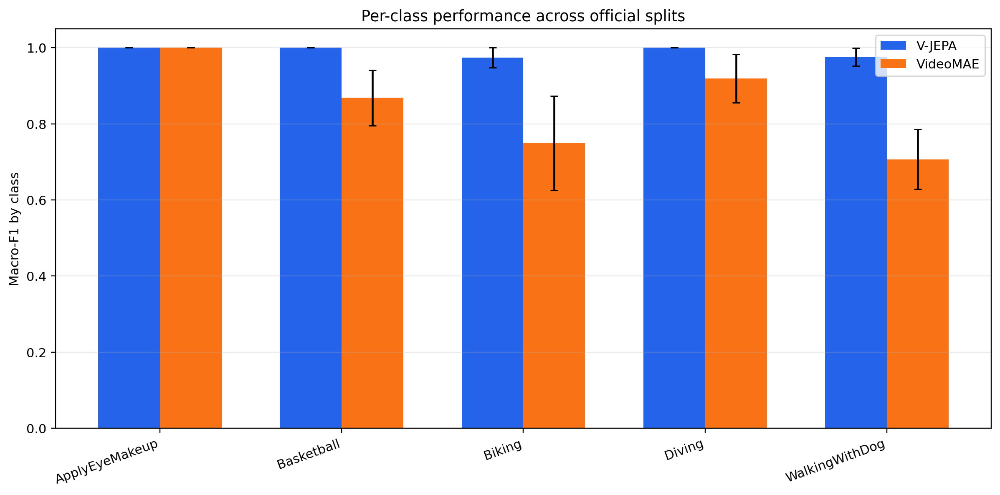
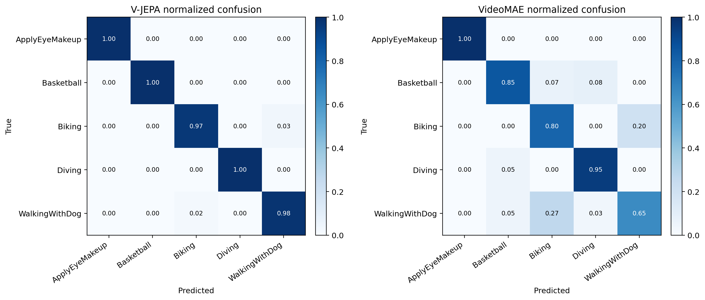

# V-JEPA vs VideoMAE — A Frozen-Feature Video Representation Comparison

> This repository builds on Meta AI's official **V-JEPA** codebase to run an independent, reproducible
> benchmark comparing two self-supervised video representation learning methods —
> **V-JEPA** (latent feature prediction) and **VideoMAE** (masked pixel reconstruction) —
> under an identical frozen-backbone, linear-probe protocol on UCF101.
>
> The base V-JEPA training/eval framework (`app/`, `evals/`, `src/`, `configs/`) is the original
> Meta AI Research codebase, kept intact and credited below. The comparison study itself lives
> entirely in [`experiments/vjepa_vs_videomae/`](experiments/vjepa_vs_videomae/README.md).

## TL;DR — what this project shows

A standardized linear probe trained on **frozen** embeddings from each backbone, evaluated on the
same five UCF101 classes across the three official train/test splits (seed 42, identical 16-frame
224×224 clips for both models):

| Model | Accuracy | Macro-F1 | Inference time / video |
|---|---|---|---|
| **V-JEPA ViT-L/16** | **0.990 ± 0.010** | **0.990 ± 0.010** | 1.486 s |
| **VideoMAE Base** | 0.850 ± 0.044 | 0.849 ± 0.041 | **0.484 s** |

- V-JEPA's latent feature-prediction representations are **+14.0 points more accurate** and
  **+14.1 points higher macro-F1** than VideoMAE's pixel-reconstruction representations, on
  exactly the same frozen-feature/linear-probe protocol.
- VideoMAE is **~3.1× faster** at inference, trading accuracy for speed.
- VideoMAE's weakest class is `WalkingWithDog` (F1 0.706 ± 0.078); V-JEPA stays above 0.97 F1 on
  every class.
- Findings are scoped to this balanced five-class frozen-feature setup, not full 101-class
  fine-tuning — see [limitations](experiments/vjepa_vs_videomae/README.md#interpretation-and-limitations).

Full methodology, reproduction scripts, and all generated figures/tables are in
[`experiments/vjepa_vs_videomae/`](experiments/vjepa_vs_videomae/README.md), with the rendered
report at [`experiments/vjepa_vs_videomae/reports/latest/report.html`](experiments/vjepa_vs_videomae/reports/latest/report.html).

<p>
  
  
</p>
<p>
  
  
</p>

## Repository structure

```
.
├── experiments/vjepa_vs_videomae/   # ★ the V-JEPA vs VideoMAE comparison study (this project's contribution)
│   ├── README.md                    #   protocol, setup, reproduction steps, results interpretation
│   ├── configs/default.yaml         #   experiment configuration
│   ├── scripts/                     #   setup, feature extraction, probe training, report generation
│   ├── src/                         #   dataset indexing, metrics, timing, reproducibility utilities
│   ├── tests/                       #   protocol unit tests
│   └── reports/latest/              #   versioned figures, tables, and the rendered HTML report
│
├── app/        # original V-JEPA pretraining entrypoints (Meta AI codebase)
├── evals/      # original V-JEPA evaluation entrypoints (Meta AI codebase)
├── src/        # original V-JEPA model/dataset/masking code (Meta AI codebase)
└── configs/    # original V-JEPA pretraining/eval configs (Meta AI codebase)
```

## Reproducing the comparison

```bash
chmod +x experiments/vjepa_vs_videomae/scripts/*.sh
experiments/vjepa_vs_videomae/scripts/setup_environment.sh
experiments/vjepa_vs_videomae/scripts/download_assets.sh
experiments/vjepa_vs_videomae/scripts/run_full_benchmark.sh
```

See [`experiments/vjepa_vs_videomae/README.md`](experiments/vjepa_vs_videomae/README.md) for the full
protocol, override options, and an explanation of every output and report figure.

---

# About the base codebase: V-JEPA

Official PyTorch codebase for the _video joint-embedding predictive architecture_, V-JEPA, a method for self-supervised learning of visual representations from video.

**[Meta AI Research, FAIR](https://ai.facebook.com/research/)**

Adrien Bardes, Quentin Garrido, Jean Ponce, Xinlei Chen, Michael Rabbat, Yann LeCun, Mahmoud Assran*, Nicolas Ballas*

[\[Blog\]](https://ai.meta.com/blog/v-jepa-yann-lecun-ai-model-video-joint-embedding-predictive-architecture/)
[\[Paper\]](https://ai.meta.com/research/publications/revisiting-feature-prediction-for-learning-visual-representations-from-video/)
[\[Yannic Kilcher's Video\]](https://www.youtube.com/watch?v=7UkJPwz_N_0)

V-JEPA models are trained by passively watching video pixels from the VideoMix2M dataset, and produce versatile visual representations that perform well on downstream video and image tasks, without adaption of the model’s parameters; e.g., using a frozen backbone and only a light-weight task-specific attentive probe.

## Method
V-JEPA pretraining is based solely on an unsupervised feature prediction objective, and does not utilize pretrained image encoders, text, negative examples, human annotations, or pixel-level reconstruction.


&emsp;&emsp;&emsp;&emsp;&emsp;


## Visualizations
As opposed to generative methods that have a pixel decoder, V-JEPA has a predictor that makes predictions in latent space.
We train a conditional diffusion model to decode the V-JEPA feature-space predictions to interpretable pixels; the pretrained V-JEPA encoder and predictor networks are kept frozen in this process.
The decoder is only fed the representations predicted for the missing regions of the video, and does not have access to the unmasked regions of the video.

The V-JEPA feature predictions are indeed grounded, and exhibit spatio-temporal consistency with the unmasked regions of the video.


<br/>


<br/>

## MODEL ZOO

#### Pretrained models

<table>
  <tr>
    <th colspan="1">model</th>
    <th colspan="1">patch size</th>
    <th colspan="1">resolution</th>
    <th colspan="1">iterations</th>
    <th colspan="1">batch size</th>
    <th colspan="1">data</th>
    <th colspan="2">download</th>
  </tr>
  <tr>
    <td>ViT-L</td>
    <td>2x16x16</td>
    <td>224x224</td>
    <td>90K</td>
    <td>3072</td>
    <td>VideoMix2M</td>
    <td><a href="https://dl.fbaipublicfiles.com/jepa/vitl16/vitl16.pth.tar">checkpoint</a></td>
    <td><a href="https://github.com/facebookresearch/jepa/blob/master/configs/pretrain/vitl16.yaml">configs</a></td>
  </tr>
  <tr>
    <td>ViT-H</td>
    <td>2x16x16</td>
    <td>224x224</td>
    <td>90K</td>
    <td>3072</td>
    <td>VideoMix2M</td>
    <td><a href="https://dl.fbaipublicfiles.com/jepa/vith16/vith16.pth.tar">checkpoint</a></td>
    <td><a href="https://github.com/facebookresearch/jepa/blob/master/configs/pretrain/vith16.yaml">configs</a></td>
  </tr>
  <tr>
    <td>ViT-H</td>
    <td>2x16x16</td>
    <td>384x384</td>
    <td>90K</td>
    <td>2400</td>
    <td>VideoMix2M</td>
    <td><a href="https://dl.fbaipublicfiles.com/jepa/vith16-384/vith16-384.pth.tar">checkpoint</a></td>
    <td><a href="https://github.com/facebookresearch/jepa/blob/master/configs/pretrain/vith16_384.yaml">configs</a></td>
  </tr>
</table>

#### K400 Attentive probes

<table>
  <tr>
    <th colspan="1">model</th>
    <th colspan="1">resolution</th>
    <th colspan="1">accuracy (16x8x3)</th>
    <th colspan="2">download</th>
  </tr>
  <tr>
    <td>ViT-L/16</td>
    <td>224x224</td>
    <td>80.8</td>
    <td><a href="https://dl.fbaipublicfiles.com/jepa/vitl16/k400-probe.pth.tar">attentive probe checkpoint</a></td>
    <td><a href="https://github.com/facebookresearch/jepa/blob/master/configs/evals/vitl16_k400_16x8x3.yaml">configs</a></td>
  </tr>
  <tr>
    <td>ViT-H/16</td>
    <td>224x224</td>
    <td>82.0</td>
    <td><a href="https://dl.fbaipublicfiles.com/jepa/vith16/k400-probe.pth.tar">attentive probe checkpoint</a></td>
    <td><a href="https://github.com/facebookresearch/jepa/blob/master/configs/evals/vith16_k400_16x8x3.yaml">configs</a></td>
  </tr>
  <tr>
    <td>ViT-H/16</td>
    <td>384x384</td>
    <td>81.9</td>
    <td><a href="https://dl.fbaipublicfiles.com/jepa/vith16-384/k400-probe.pth.tar">attentive probe checkpoint</a></td>
    <td><a href="https://github.com/facebookresearch/jepa/blob/master/configs/evals/vith16_384_k400_16x8x3.yaml">configs</a></td>
  </tr>
</table>

#### SSv2 Attentive probes

<table>
  <tr>
    <th colspan="1">model</th>
    <th colspan="1">resolution</th>
    <th colspan="1">accuracy (16x2x3)</th>
    <th colspan="2">download</th>
  </tr>
  <tr>
    <td>ViT-L/16</td>
    <td>224x224</td>
    <td>69.5</td>
    <td><a href="https://dl.fbaipublicfiles.com/jepa/vitl16/ssv2-probe.pth.tar">attentive probe checkpoint</a></td>
    <td><a href="https://github.com/facebookresearch/jepa/blob/master/configs/evals/vitl16_ssv2_16x2x3.yaml">configs</a></td>
  </tr>
  <tr>
    <td>ViT-H/16</td>
    <td>224x224</td>
    <td>71.4</td>
    <td><a href="https://dl.fbaipublicfiles.com/jepa/vith16/ssv2-probe.pth.tar">attentive probe checkpoint</a></td>
    <td><a href="https://github.com/facebookresearch/jepa/blob/master/configs/evals/vith16_ssv2_16x2x3.yaml">configs</a></td>
  </tr>
  <tr>
    <td>ViT-H/16</td>
    <td>384x384</td>
    <td>72.2</td>
    <td><a href="https://dl.fbaipublicfiles.com/jepa/vith16-384/ssv2-probe.pth.tar">attentive probe checkpoint</a></td>
    <td><a href="https://github.com/facebookresearch/jepa/blob/master/configs/evals/vith16_384_ssv2_16x2x3.yaml">configs</a></td>
  </tr>
</table>

#### ImageNet1K Attentive probes

<table>
  <tr>
    <th colspan="1">model</th>
    <th colspan="1">resolution</th>
    <th colspan="1">accuracy</th>
    <th colspan="2">download</th>
  </tr>
  <tr>
    <td>ViT-L/16</td>
    <td>224x224</td>
    <td>74.8</td>
    <td><a href="https://dl.fbaipublicfiles.com/jepa/vitl16/in1k-probe.pth.tar">attentive probe checkpoint</a></td>
    <td><a href="https://github.com/facebookresearch/jepa/blob/master/configs/evals/vitl16_in1k.yaml">configs</a></td>
  </tr>
  <tr>
    <td>ViT-H/16</td>
    <td>224x224</td>
    <td>75.9</td>
    <td><a href="https://dl.fbaipublicfiles.com/jepa/vith16/in1k-probe.pth.tar">attentive probe checkpoint</a></td>
    <td><a href="https://github.com/facebookresearch/jepa/blob/master/configs/evals/vith16_in1k.yaml">configs</a></td>
  </tr>
  <tr>
    <td>ViT-H/16</td>
    <td>384x384</td>
    <td>77.4</td>
    <td><a href="https://dl.fbaipublicfiles.com/jepa/vith16-384/in1k-probe.pth.tar">attentive probe checkpoint</a></td>
    <td><a href="https://github.com/facebookresearch/jepa/blob/master/configs/evals/vith16_384_in1k.yaml">configs</a></td>
  </tr>
</table>

#### Places205 Attentive probes

<table>
  <tr>
    <th colspan="1">model</th>
    <th colspan="1">resolution</th>
    <th colspan="1">accuracy</th>
    <th colspan="2">download</th>
  </tr>
  <tr>
    <td>ViT-L/16</td>
    <td>224x224</td>
    <td>60.3</td>
    <td><a href="https://dl.fbaipublicfiles.com/jepa/vitl16/places-probe.pth.tar">attentive probe checkpoint</a></td>
    <td><a href="https://github.com/facebookresearch/jepa/blob/master/configs/evals/vitl16_places.yaml">configs</a></td>
  </tr>
  <tr>
    <td>ViT-H/16</td>
    <td>224x224</td>
    <td>61.7</td>
    <td><a href="https://dl.fbaipublicfiles.com/jepa/vith16/places-probe.pth.tar">attentive probe checkpoint</a></td>
    <td><a href="https://github.com/facebookresearch/jepa/blob/master/configs/evals/vith16_places.yaml">configs</a></td>
  </tr>
  <tr>
    <td>ViT-H/16</td>
    <td>384x384</td>
    <td>62.8</td>
    <td><a href="https://dl.fbaipublicfiles.com/jepa/vith16-384/places-probe.pth.tar">attentive probe checkpoint</a></td>
    <td><a href="https://github.com/facebookresearch/jepa/blob/master/configs/evals/vith16_384_places.yaml">configs</a></td>
  </tr>
</table>

#### iNat21 Attentive probes

<table>
  <tr>
    <th colspan="1">model</th>
    <th colspan="1">resolution</th>
    <th colspan="1">accuracy</th>
    <th colspan="2">download</th>
  </tr>
  <tr>
    <td>ViT-L/16</td>
    <td>224x224</td>
    <td>67.8</td>
    <td><a href="https://dl.fbaipublicfiles.com/jepa/vitl16/inat-probe.pth.tar">attentive probe checkpoint</a></td>
    <td><a href="https://github.com/facebookresearch/jepa/blob/master/configs/evals/vitl16_inat.yaml">configs</a></td>
  </tr>
  <tr>
    <td>ViT-H/16</td>
    <td>224x224</td>
    <td>67.9</td>
    <td><a href="https://dl.fbaipublicfiles.com/jepa/vith16/inat-probe.pth.tar">attentive probe checkpoint</a></td>
    <td><a href="https://github.com/facebookresearch/jepa/blob/master/configs/evals/vith16_inat.yaml">configs</a></td>
  </tr>
  <tr>
    <td>ViT-H/16</td>
    <td>384x384</td>
    <td>72.6</td>
    <td><a href="https://dl.fbaipublicfiles.com/jepa/vith16-384/inat-probe.pth.tar">attentive probe checkpoint</a></td>
    <td><a href="https://github.com/facebookresearch/jepa/blob/master/configs/evals/vith16_384_inat.yaml">configs</a></td>
  </tr>
</table>

## Code Structure

**Config files:**
All experiment parameters are specified in config files (as opposed to command-line arguments). See the [configs/](configs/) directory for example config files. Note, before launching an experiment, you must update the paths in the config file to point to your own directories, indicating where to save the logs and checkpoints and where to find the training data.


```
.
├── app                       # the only place where training loops are allowed
│   ├── vjepa                 #   Video JEPA pre-training
│   ├── main_distributed.py   #   entrypoint for launching app on slurm cluster
│   └── main.py               #   entrypoint for launching app locally on your machine for debugging
├── evals                     # the only place where evaluation of 'apps' are allowed
│   ├── image_classification  #   training an attentive probe for image classification with frozen backbone
│   ├── video_classification  #   training an attentive probe for video classification with frozen backbone
│   ├── main_distributed.py   #   entrypoint for launching distributed evaluations on slurm cluster
│   └── main.py               #   entrypoint for launching evaluations locally on your machine for debugging
├── src                       # the package
│   ├── datasets              #   datasets, data loaders, ...
│   ├── models                #   model definitions
│   ├── masks                 #   mask collators, masking utilities, ...
│   └── utils                 #   shared utilities
└── configs                   # the only place where config files are allowed (specify experiment params for app/eval runs)
    ├── evals                 #   configs for launching vjepa frozen evaluations
    └── pretrain              #   configs for launching vjepa pretraining

```

## Data preparation

### Video Datasets
V-JEPA pretraining and evaluations work with many standard video formats.
To make a video dataset compatible with the V-JEPA codebase, you simply need to create a `.csv` file with the following format and then specify the path to this CSV file in your config.
```
/absolute_file_path.[mp4, webvid, etc.] $integer_class_label
/absolute_file_path.[mp4, webvid, etc.] $integer_class_label
/absolute_file_path.[mp4, webvid, etc.] $integer_class_label
...
```
Since V-JEPA is entirely unsupervised, the pretraining code will disregard the `$integer_class_label` in the CSV file.
Thus, feel free to put a random value in this column.
However, if you wish to run a supervised video classification evaluation on your video dataset, you must replace ```$integer_class_label``` with the ground truth label for each video.

### Image Datasets
We use the standard PyTorch ```ImageFolder``` class in our image classification evals.
Thus, to set up an image dataset for the image classification evaluation, first create a directory to store your image datasets ```$your_directory_containing_image_datasets```.
Next, download your image datasets into this directory in a format compatible with [PyTorch ImageFolder](https://pytorch.org/vision/main/generated/torchvision.datasets.ImageFolder.html).

For example, suppose we have a directory called ``my_image_datasets``. We would then download our image datasets into this directory so that we end up with the following file tree
```
.
└── /my_image_datasets/                # where we store image datasets
    ├── places205/121517/pytorch/      #   Places205
    │   └── [...]
    ├── iNaturalist-2021/110421/       #   iNaturalist21
    │   └── [...]
    ├── [...]                          #   Other Image Datasets
    │   └── [...]
    └── imagenet_full_size/061417/     #   ImageNet1k
        └── train
        │   ├── $class_1
        │   │    ├── xxx.[png, jpeg, etc.]
        │   │    ├── [...]
        │   │    └── xxz.[png, jpeg, etc.]
        │   ├── [...]
        │   └── $class_n
        │       ├── abc.[png, jpeg, etc.]
        │       ├── [...]
        │       └── abz.[png, jpeg, etc.]
        └── val
            ├── $class_1
            │    ├── xxx.[png, jpeg, etc.]
            │    ├── [...]
            │    └── xxz.[png, jpeg, etc.]
            ├── [...]
            └── $class_n
                ├── abc.[png, jpeg, etc.]
                ├── [...]
                └── abz.[png, jpeg, etc.]
```


## Launching V-JEPA pretraining

### Local training
If you wish to debug your code or setup before launching a distributed training run, we provide the functionality to do so by running the pretraining script locally on a multi-GPU (or single-GPU) machine, however, reproducing our results requires launching distributed training.

The single-machine implementation starts from the [app/main.py](appmain.py), which parses the experiment config file and runs the pretraining locally on a multi-GPU (or single-GPU) machine.
For example, to run V-JEPA pretraining on GPUs "0", "1", and "2" on a local machine using the config [configs/pretrain/vitl16.yaml](configs/pretrain/vitl16.yaml), type the command:
```bash
python -m app.main \
  --fname configs/pretrain/vitl16.yaml \
  --devices cuda:0 cuda:1 cuda:2
```

### Distributed training
To launch a distributed training run, the implementation starts from [app/main_distributed.py](app/main_distributed.py), which, in addition to parsing the config file, also allows for specifying details about distributed training. For distributed training, we use the popular open-source [submitit](https://github.com/facebookincubator/submitit) tool and provide examples for a SLURM cluster.

For example, to launch a distributed pre-training experiment using the config [configs/pretrain/vitl16.yaml](configs/pretrain/vitl16.yaml), type the command:
```bash
python -m app.main_distributed \
  --fname configs/pretrain/vitl16.yaml \
  --folder $path_to_save_stderr_and_stdout \
  --partition $slurm_partition
```

## Launching Evaluations

### Local training
If you wish to debug your eval code or setup before launching a distributed training run, we provide the functionality to do so by running the evaluation script locally on a multi-GPU (or single-GPU) machine, however, reproducing the full eval would require launching distributed training.
The single-machine implementation starts from the [eval/main.py](eval/main.py), which parses the experiment config file and runs the eval locally on a multi-GPU (or single-GPU) machine.

For example, to run ImageNet image classification on GPUs "0", "1", and "2" on a local machine using the config [configs/eval/vitl16_in1k.yaml](configs/eval/vitl16_in1k.yaml), type the command:
```bash
python -m evals.main \
  --fname configs/eval/vitl16_in1k.yaml \
  --devices cuda:0 cuda:1 cuda:2
```


### Distributed training
To launch a distributed evaluation run, the implementation starts from [eval/main_distributed.py](eval/main_distributed.py), which, in addition to parsing the config file, also allows for specifying details about distributed training. For distributed training, we use the popular open-source [submitit](https://github.com/facebookincubator/submitit) tool and provide examples for a SLURM cluster.

For example, to launch a distributed ImageNet image classification experiment using the config [configs/eval/vitl16_in1k.yaml](configs/eval/vitl16_in1k.yaml), type the command:
```bash
python -m evals.main_distributed \
  --fname configs/eval/vitl16_in1k.yaml \
  --folder $path_to_save_stderr_and_stdout \
  --partition $slurm_partition
```

Similarly, to launch a distributed K400 video classification experiment using the config [configs/eval/vitl16_k400.yaml](configs/eval/vitl16_k400.yaml), type the command:
```bash
python -m evals.main_distributed \
  --fname configs/eval/vitl16_k400.yaml \
  --folder $path_to_save_stderr_and_stdout \
  --partition $slurm_partition
```

---

### Setup

Run:
```bash
conda create -n jepa python=3.9 pip
conda activate jepa
python setup.py install
```

## License
See the [LICENSE](./LICENSE) file for details about the license under which this code is made available.

## Citation
If you find this repository useful in your research, please consider giving a star :star: and a citation
```bibtex
@article{bardes2024revisiting,
  title={Revisiting Feature Prediction for Learning Visual Representations from Video},
  author={Bardes, Adrien and Garrido, Quentin and Ponce, Jean and Rabbat, Michael, and LeCun, Yann and Assran, Mahmoud and Ballas, Nicolas},
  journal={arXiv:2404.08471},
  year={2024}
}
