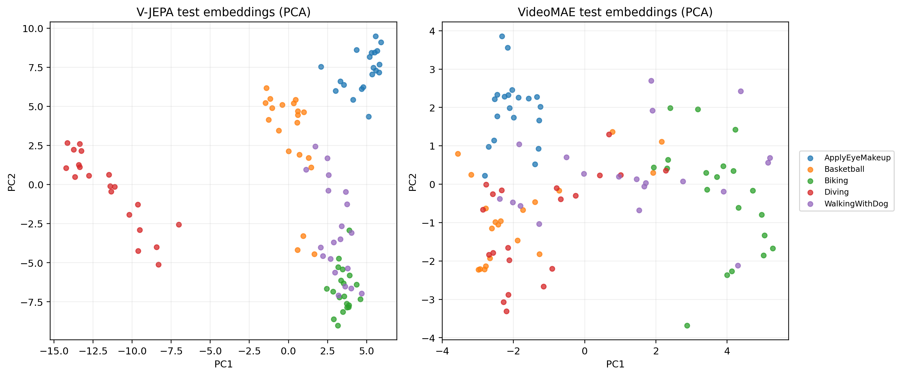
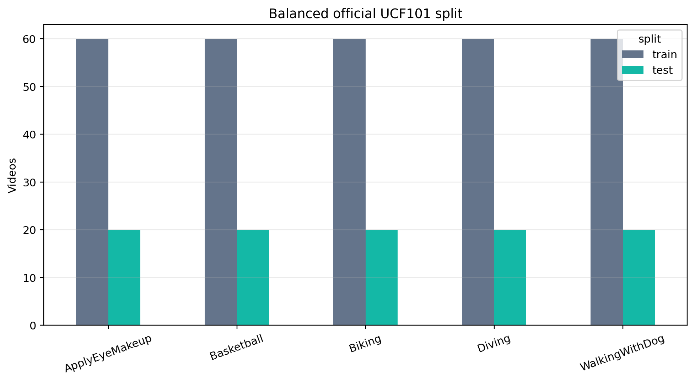
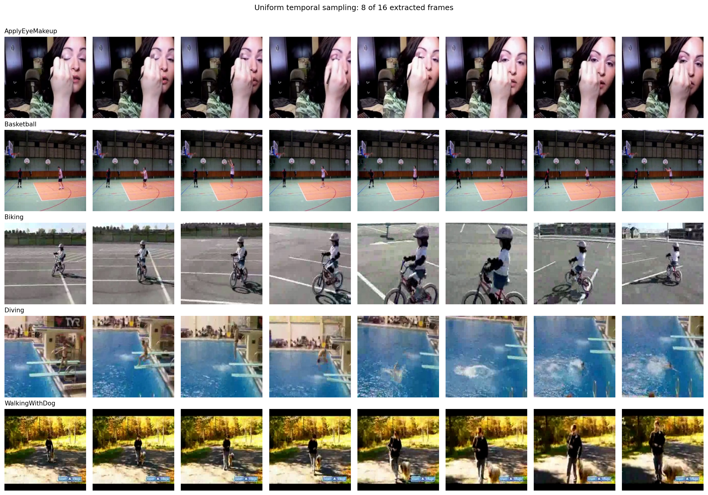
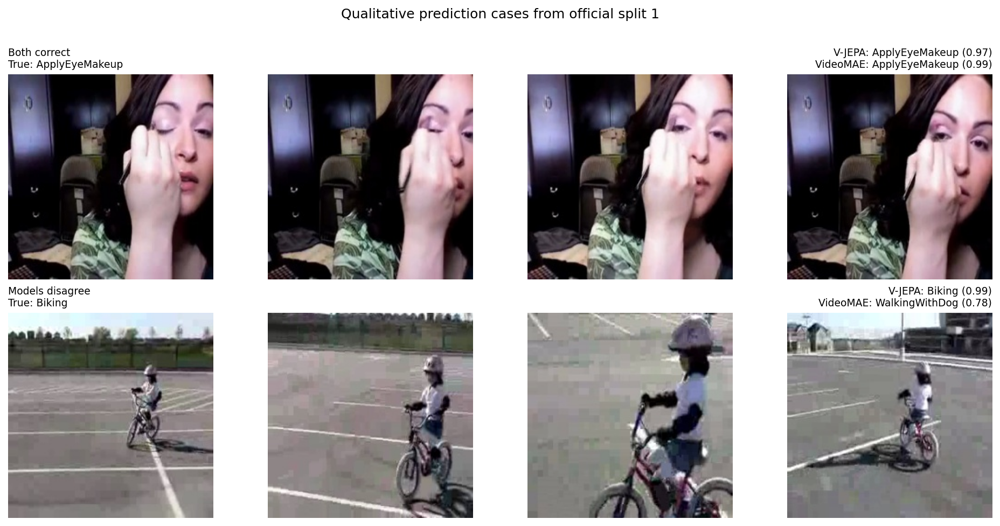
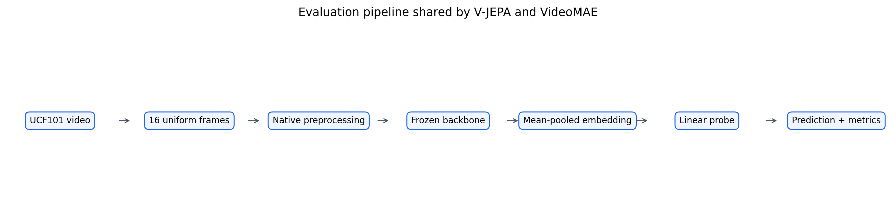
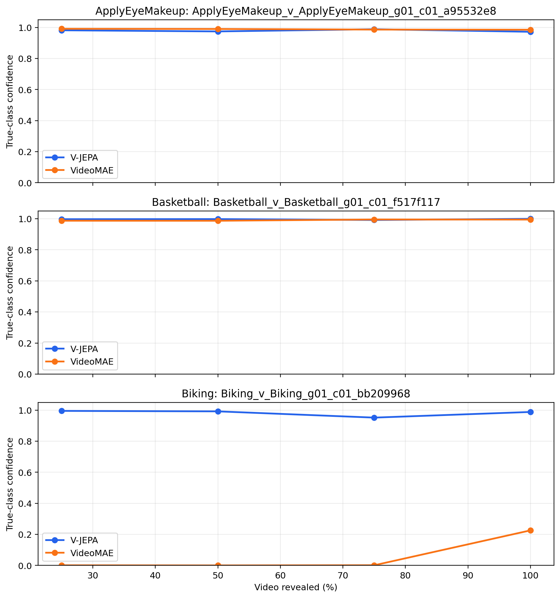

# V-JEPA vs VideoMAE on UCF101

Frozen-feature comparison on five classes and the three official splits.

## Protocol

- Official UCF101 splits 1, 2, and 3; seed 42.
- Five classes, with 60 train and 20 test videos per class and split.
- Identical 16-frame, 224×224 clips for both frozen backbones.
- Mean pooling followed by the same StandardScaler + LogisticRegression.
- Timings measured on Apple MPS after one excluded warm-up pass.

## Key findings

- V-JEPA accuracy: **0.990 ± 0.010**; VideoMAE: **0.850 ± 0.044**.
- V-JEPA gains **14.0 percentage points** in accuracy and **14.1 points** in macro-F1.
- VideoMAE is **3.07× faster** at model inference (0.484 s/video versus 1.486 s/video).
- VideoMAE's hardest class is **WalkingWithDog** (F1 0.706 ± 0.078); V-JEPA remains above 0.97 F1 on every class.

> Scope: these conclusions apply to this balanced five-class frozen-feature protocol, not to full 101-class fine-tuning.

## Results by split

|   split_id | model_name   |   accuracy |   f1_macro |   top3_accuracy |   inference_time_per_video_seconds |
|-----------:|:-------------|-----------:|-----------:|----------------:|-----------------------------------:|
|          1 | vjepa        |     1.0000 |     1.0000 |          1.0000 |                             1.4629 |
|          1 | videomae     |     0.8800 |     0.8769 |          0.9900 |                             0.4805 |
|          2 | vjepa        |     0.9900 |     0.9900 |          1.0000 |                             1.5039 |
|          2 | videomae     |     0.8700 |     0.8673 |          1.0000 |                             0.4825 |
|          3 | vjepa        |     0.9800 |     0.9799 |          1.0000 |                             1.4911 |
|          3 | videomae     |     0.8000 |     0.8015 |          0.9800 |                             0.4885 |

## Aggregate metrics

| model_name   |   accuracy_mean |   accuracy_std |   balanced_accuracy_mean |   balanced_accuracy_std |   f1_macro_mean |   f1_macro_std |   f1_weighted_mean |   f1_weighted_std |   precision_macro_mean |   precision_macro_std |   recall_macro_mean |   recall_macro_std |   top3_accuracy_mean |   top3_accuracy_std |   inference_time_per_video_seconds_mean |   inference_time_per_video_seconds_std |   pipeline_time_per_video_seconds_mean |   pipeline_time_per_video_seconds_std |   train_time_seconds_mean |   train_time_seconds_std |   feature_dim | device_used   |
|:-------------|----------------:|---------------:|-------------------------:|------------------------:|----------------:|---------------:|-------------------:|------------------:|-----------------------:|----------------------:|--------------------:|-------------------:|---------------------:|--------------------:|----------------------------------------:|---------------------------------------:|---------------------------------------:|--------------------------------------:|--------------------------:|-------------------------:|--------------:|:--------------|
| vjepa        |          0.9900 |         0.0100 |                   0.9900 |                  0.0100 |          0.9900 |         0.0100 |             0.9900 |            0.0100 |                 0.9908 |                0.0091 |              0.9900 |             0.0100 |               1.0000 |              0.0000 |                                  1.4860 |                                 0.0210 |                                 1.5300 |                                0.0233 |                    0.0181 |                   0.0018 |          1024 | mps           |
| videomae     |          0.8500 |         0.0436 |                   0.8500 |                  0.0436 |          0.8486 |         0.0411 |             0.8486 |            0.0411 |                 0.8607 |                0.0361 |              0.8500 |             0.0436 |               0.9900 |              0.0100 |                                  0.4838 |                                 0.0042 |                                 0.5378 |                                0.0049 |                    0.0168 |                   0.0011 |           768 | mps           |

## Metric overview

## Per-class F1

## Accuracy versus speed

## Confusion matrices

## Embedding PCA

## Dataset balance

## Video storyboards

## Prediction examples

## Processing pipeline

## Confidence through time

